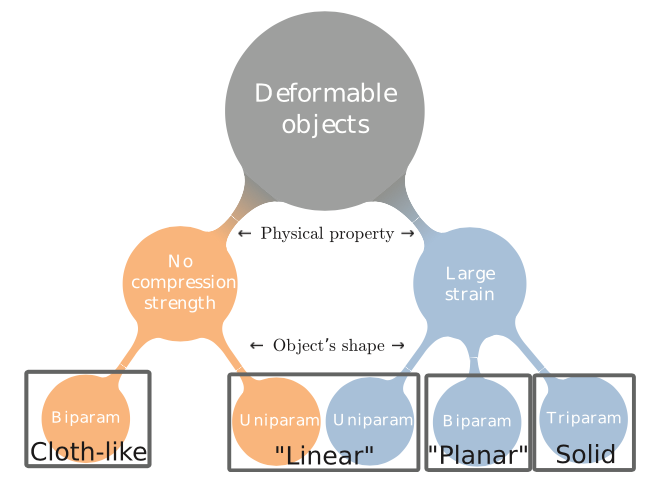
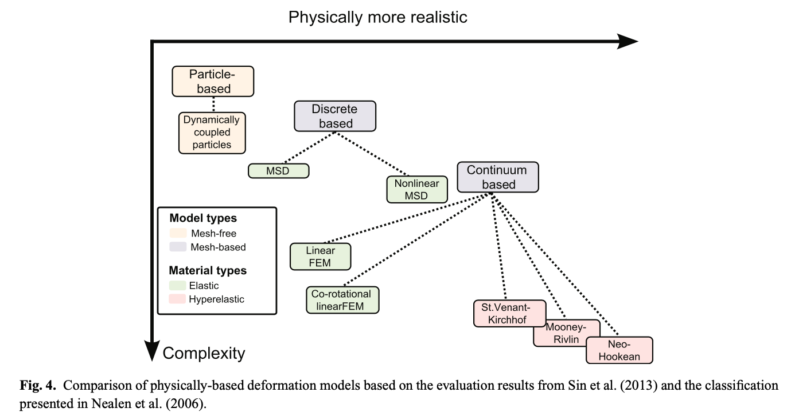

# **Robotic manipulation and sensing of deformable objects in domestic and industrial applications: a survey**

## 1. Potential Application of Deformable Object Manipulation (DOM)

- medicine (e.g. surgical assistance)
- food handling (e.g. handling fragile product in food industry)
- manufacturing (e.g. manipulate flexible objects)
- domestic chores (dressing, feeding)

## 2. Limitaion of Rigid-body Manipulation Theory in DOM

- Form Closure Assumption (No relative Motion when applying kinematic contraints) 
- Force Closure Assumption (Force balance after applying arbitrary external force with a set of contact points)

## 3. Categories of Deformable Object (DO)

### 3.1 Based on Geometry
- Uniparam & No Compression Strength (e.g. cables, strings, ropes)
- Uniparam & Large Strain 
- Biparam & No Compression Strength (e.g. Shirts, pants, curtains, and fabric sheets)
- Biparam & Large Strain (e.g. paper, cards and foam sheets)
- Triparam (e.g. Sponge, plush toys and food products)

### 3.2 Based on Applications

- sensing
- manipulation
- task-specific

## 4. Modeling DO

### 4.1 Some parameters of DO

- Modulus of elasticity (Hook law, stress = strain * Modulus of elasticity)
- Possion'ratio

### 4.2 Modeling Method

- MSD (Mass-Spring-Damper) (limit: Cannot preserve volume)
- FEM (Finite-Element Method) (limit: complicated)

## 5. Linear Object

### 5.1 Sensing

- Node graph, stereo vision system (Matsuno 2006)
- Solve parameters using energy function considering forces (Javdani 2011)
- Solve stiffness of spring (treated as rigid links) using error function based on proprioception sensing, visual information (Caldwell, 2014)

### 5.2 Manipulation

- Shape control (Yamakawa 2010) 
- Untangling ropes, RGB-D Data, group segments with region-growing algorithm, search for preparation configuration with partical filter (Lui and Saxena 2013)
- Insertion
  - Insertion for needle threading and assembly, represent hole with vector fields. (Weifu Wang 2015)
  - Insertion, motion planning achieving objectives (e.g. collision avoidance, minimum deformation)
- Reach desired configuration
  - Find an intermediate configurations to desired configuration, RRT, motion planning. (Lamiraux and Kavraki, 2001; Moll and Kavraki, 2004, 2006)
  - Find the state among next states that is closer to goal state based on physics engine, motion planing, eploited external forces from environment (Roussel an Ta 2014)
	- Find combination of actions that solved clamping task, given not violating the contraint of overstretching the interlinks. (Shah 2016)

  (__comments on  motion planning__: Time consuming, take minutes to solve for one iterration, mostly tested in simulation)

### 5.3 Task-specific: Knot Tying

- Simple description of a rope, identifying intersection, vision system and tactile sensing (Yamakawa 2008)
- Human Demonstration, open-loop, 3 Primitives: (1) grasping rope (2) producing loop (3) pulling rope (Vinh 2012), Tie in the air with two arm (Kudoh 2015), limit: not robust to disturbance
- knot in the air, without model, close-loop, high-speed sensor, rope represented as rigid joints, time-delay consideration (Yamakawa 2010)
- learning technique
	- Learn from demonstration, learn mapping from training trajectory to testing ones, minimize object bending (calculated with Plate Spline Robust Point Matching (TPS-RPM)), point cloud from RGBD, points represent gripper trajectories and object states.(Lee 2014)
	- Label parts of object (e.g. end-points and crossing) with CNN (Huang 2015)
- tie around a pipe
	- Dual arm to manipulate shape
	- necessary condition (Lee 2014), incoporate force info (Lee 2015)  

## 6. Planar object

### 6.1 Deformation Sensing

- Identify elasticity parameters, optimize to reduce difference between observation and simulation, stereo-vision, track markers (Boonvisut and Cavusoglu 2013)
- Track object with physics model
	-  track deformable of tennis ball, Shell Theory, (Tian and Jia 2010)
	-  Track invisible part, physics-engine + probabilistic model, depth sensor (Schulman 2013), cannot recover from diverge
	-  Group points to reduce dimensionality, hill climbing algorithms to classify the batches (Boonvisut and Cavusoglu 2014)

### 6.2 Manipulation

#### 6.2.1 Paper folding

- Open loop, suction pump to hold, clamp to fix (Balkcom and Mason 2008)
- bi-manual robot equipped with 5-fingured hand, five calibrated camera, fiducial markers, simulated with physics engine, represented as link dynamics (Elbrechter 2011)
- simulated with MSD model, dynamic primitives to fold paper, use paper corner as markers (Namiki and Yokosawa 2015)

#### 6.2.2 Grasp and pick up

- extend concept of form closure to DO, deform closure, potential energy to define grasping, FEM model and stiffness matrix to compute internal force for computing potential energy. (Gopalakraishnan and Goldberg 2004)
- two finger, potential energy = force x distance, stick or slip mode of contact points to infer if the object slip out, ring object and solid planar object (Guo and Jia 2011 2013)
- Pure Squeeze, Stable Squeeze: minimal ptential energy or deformation given same squeeze depth.

#### 6.2.3 Rotation

- resting on the plate attached to  robot endeffector, rotate and translate single axis, cannot control deformation (Ramirez-Alpizar2012)
- two gripper, open loop (Kristek and Shell 2012)

### 6.3 Deformable Control

move target points to desired position, so that overall shape approximate desired deformed shape.

#### 6.3.1 single point control

- single point to desired position, trajectory generator, control fingers with PI ocntorller, passivity observer and controller to control energy, only simulation with known parameters. (Das and Sarkar 2010 2013)

#### 6.3.2 multi points control

- linearize deformation model, combine position and velocity into one state,   reproducing kernel particle method (RKPM) to predict dynamics model given force on points, a output regulator to drive the points, only simulation,  (Fanson and Patriciu 2010)
- H8 control, FEM-based model (Kinio and Patriciu 2012)
- use Kelvin-Voigt model in MSD simulation (Das and Sarkar 2011)
- model-free, diminishing rigidity, points farther from a gripper are affected less, approximate Jacobian (Berenson, 2013), extend version, choosing Jacbian model with multi-arm bandit formulation. (McConachie and Berenson 2016)

## 7. Cloth-like objects

### 7.1 sensing

#### 7.1.1 state estimation
- Estimating deformation using 3D visual data and simulation based on object size and softness, reduce uncertainty with regrasping (Kita 2011)
- recontructed object with depth data, and compare with mesh model database, hamming distance of two vectors between recontructed model and database model. (Li 2014)
- check whether article is folded correctly, HMM with single input feature, distance between contour point to the other contour points, called Shape Context, more informative. (Bergstrom 2012)
- classify the jeans and woolen items, use fusion techniques (majority voting), use a variety of ML (random forests, HMMs), Limit: some cases show inferior performance w.r.t. non-fusion baselines. (Kampouris 2016)

#### 7.1.2 Grasp point detection

- detecting collar, polo shirt, Bag of Features (BoF) that are generated by scale-invariant feauture transform (SIFT) features from 2D image and Depth data (Ramisa 2012)
- selecting grasp points, only depth data, compared with trainning dataset to select the most similar point, and execute the corresponding manually assigned grasps. (Yamazaki 2014)

### 7.2 Grasping and Manipulation

#### 7.2.1 grasping for garment picking-up

- generate wrinkle by moving jaws of robot grippers toward each other, assume cloth lie flat on surface. (Shibata 2009)
- No lying flat assumption, model as Partially Observable Markov Decision Problem(POMP), moving cloth from one side to another, pick up when uncertainty lower than threshold, goal is minimum actions. (Monso 2012)

#### 7.2.2 Manipulation for garment reconfiguration

- bring to desigred configuration, HMM to estimate state of garment, state include category, size, and grasp points, a cloth simulator, a planning algorithm to regrasp repeatedly, once the configuration is known the robot bring the object to desired configuration (Cusumano-Towner 2011)
- faster, Procedure: pickup at a random point, grasp the lowest point with another arm, release the 1st arm to hang in the air, rotate the object continuously using POMP, detect the desired grasp point, grasp the other point with another arm. The procedure allows to unfold article, Hough forest (random forest) is used to classify grasp points, article is divided into 8x8 bound boxs for grasp points (Doumanoglou 2014)
- thin-shell simulation, built a database of simluated model, compare rotating mulitple-views depth-data with simluated model, interative cloeset point to apply rigid registration (without deformation) and non-rigid registration (deformation) to reconstruct the object model. (Li 2015)
- stretch to flatten out wrinkles, RGB-D data, wrinkles represented as 5th order polinomial, weighted based on volume, select the largest wrinkle and flatten with predfine motion (Sun 2015)
- bybird forvce-vision control, include human in the loop, RGB-D sensor for vision, torque sensor estimated by joint torque, normal to control velocity magnitude, force velocity and vision velocity are combined by addition. (Kruse 2015)

### 7.3 Cloth-specific task

folding, hanging clothes and assisting in dressing people

#### 7.3.1 Folding

- First to complete full task of folding, detecting grasp points to faciliate folding, assume cloth is rectangle shape, stereo, detect edge with depth discontinuities. (Maitin-Shepard 2010)
- limit, full of fiducial marker (Bersch 2011)
- only folding action, fold in the midair, position grasped by gripper is in the same pos with gripper, position of the rest is portional to distance to grasp point controlled by single parameter, termed Time Delay (Yamakawa 2011)

- polynomial representation
	- gravity fold (Miller 2012)
	- faster (in seconds), angles and distance of vertics, classify with encode features (Stria 2014)
	- Trajectory parameterized by Bezier curve (Li 2015)

- Machine Learning
	- RL, taught by human teacher, 28 markers attached to boundary. (Balaguer and Carpin 2011)

#### 7.3.2 clothing assistance and hanging

- help put on a shirt, RL, customized topology coordinates, motion capture tracking points, human teacher to teacher initial trajectory, RL modify the way-points. (Tamei 2011)
- help out putting a pair of pants, depth data to detect location of legs, force sensor to detect possible failure. (Yamazaki 2014)
- predicting outcomes of dressing medical gown, HMM, haptic data generated from simulator (Yu 2017)
- RNN, analyze force distribution (erickson 2017)

- hang a knit cap on a coat rack, depth data, point cloud to detect edges (Twardon and Ritter 2015)